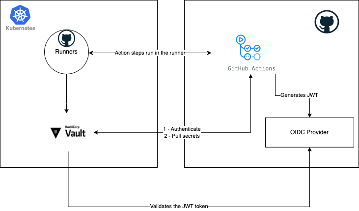

# Vault Github Actions POC

This document describes the Vault Github Action POC

## Architecture



## Requirements 
- Kubernetes cluster
- Helm
- Self Hosted runners
- Github Personal KEY: https://docs.github.com/en/enterprise-server@3.4/authentication/keeping-your-account-and-data-secure/creating-a-personal-access-token


## Setup Github Runners

### Install cert-manager

Required for ARC

```sh
kubectl apply -f https://github.com/cert-manager/cert-manager/releases/download/v1.11.0/cert-manager.yaml
```

### Install ARC

```sh
export GITHUB_TOKEN=<YOUR KEY> # SET YOUR GITHUB TOKEN HERE 
helm upgrade --install \
	--namespace actions-runner-system \
	--create-namespace \
	--set=authSecret.create=true \
	--set=authSecret.github_token=$GITHUB_TOKEN \
 	--wait actions-runner-controller actions-runner-controller/actions-runner-controller

```

### Deploy Github Runner
```sh
cat <<EOF | kubectl apply -f -
apiVersion: actions.summerwind.dev/v1alpha1
kind: RunnerDeployment
metadata:
  name: example-runnerdeploy
spec:
  # This will deploy 2 runners now
  replicas: 1
  template:
    spec:
      repository: <YOUR_ORG>/<REPO_NAME>
EOF
```

You shoud see the runners in the repo `Settings > Actions > Runners`


## Setup Vault 

```sh
helm repo add hashicorp https://helm.releases.hashicorp.com

helm upgrade vault -i hashicorp/vault --set server.dev.enabled=true --set server.dev.devRootToken=root
```

### Configure Vault using terraform

Requirements:
- `kubectl porf-forward svc/vault:8200`

```sh

variable "github_org" {
    default = "my-org"
}

provider "vault" {
  # Vault Address
  address = "http://127.0.0.1:8200"

  # Token
  token   = "root" 
}

# Configure JWT Backend for Github OIDC Provider
resource "vault_jwt_auth_backend" "example" {
    description         = "Demonstration of the Terraform JWT auth backend"
    path                = "jwt"
    oidc_discovery_url  = "https://token.actions.githubusercontent.com"
    bound_issuer        = "https://token.actions.githubusercontent.com"
}

# Configure roles for github repos
resource "vault_jwt_auth_backend_role" "example" {
  backend         = vault_jwt_auth_backend.example.path
  role_name       = "test-role"

  # Policies attached to the role
  token_policies  = ["default", "dev"]

  bound_claims_type = "glob"

  # repos that can authenticate
  bound_claims = {
    sub = "repo:${var.github_org}/*"
  }

  user_claim      = "actor"
  role_type       = "jwt"
}

# repos permissions
resource "vault_policy" "example" {
  name = "dev"

  policy = <<EOT
path "kvv1/*" {
  capabilities = [ "read" ]
}
EOT
}

# Configure the secrets - just example
resource "vault_mount" "kvv1" {
  path        = "kvv1"
  type        = "kv"
  options     = { version = "1" }
  description = "KV Version 1 secret engine mount"
}

resource "vault_kv_secret" "example" {
  path                      = "${vault_mount.kvv1.path}/test"
  data_json                  = jsonencode(
    {
        zip       = "zap",
        foo       = "bar"
    }
  )
}
```

## Using the github action

Put this file in .github/workflows

```yaml
name: 'Test vault'

on:
  workflow_dispatch:
  push:
    branches:
      - main

jobs:
  setup:
    # Your runner label
    runs-on:
      - "self-hosted"

    # Permissions to generate the token from Github OIDC Provider
    permissions:
      id-token: write
      contents: read
    steps:
      - name: Retrieve secret from Vault
        uses: hashicorp/vault-action@v2.5.0
        with:
          method: jwt

          # Vault URL
          url: http://vault:8200

          # Used for vault enterprise
          #namespace: <Vault Namespace - HCP Vault and Vault Enterprise only>
          
          # Role used by this repo
          role: test-role

          # read the attribute foo from key kvv1t/test and set the
          # environment variable TEST
          secrets: kvv1/test foo | TEST

      # Test the secret
      - name: print secret
        run: |
          echo ${{ env.TEST }} | sed 's/./& /g'

```
